# Chapter 1: Setup and Practice with VS Code 

## Objectives

* Practice with VS Code
* Practice with markdown files
* Install VS Code extensions
  

## NOTES for THROUGHOUT the course

* Each lab uses a README file such as this
  * for each exercise follow all steps to the bottom of the document
* Please pay attention to detail. Follow each step carefully.
* If you ever feel lost - ask your instructor, neighbor and/or use chat. 
  * Much is learned in helping each other.
* Throughout the course the terms **folder** and **directory** are used interchangeable.
* You may see references to **Enter** key and **Return** key. 
  * These are the same intention
  * Enter is usually found on Windows and Return on Macs.
* When you get to coding - you must save changes to your files to see the effects take place. 
  * Control+S is the FASTEST. You can also use File | Save but this wastes seconds - adding up to minutes, etc...

## Table of Contents for this lab

[Part 1 - The Angular100-Labs project](#part-1---the-angular100-labs-project)

[Part 2 - Opening files in VS Code and changing default settings](#part-2---vs-code-default-settings-when-opening-files-)

[Part 3 - Toggle Word Wrapping](#part-3---toggle-word-wrapping-in-vs-code)

[Part 4 - Markdown .md files in Edit & Preview Mode](#part-4---opening-markdown-md-files-in-vs-code-in-preview-mode)

[Part 5 - Install and use extensions](#part-5---install-and-use-extensions)

[Part 6 - Find the Bonuses](#part-6---find-the-bonus-section)

### **Part 1 - The Angular100-Labs project**
[back to top](#table-of-contents-for-this-lab)

1. Make sure you have VS Code open to the Explorer pane, listing the files/directories. Recall to click the Explorer icon if the view is hidden. 

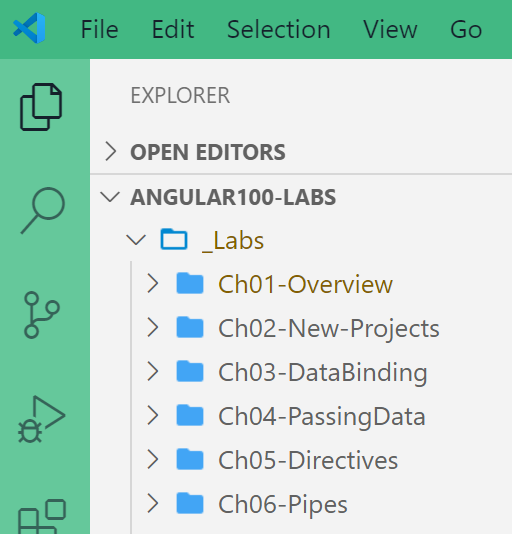

2. Understanding the Angular100-Labs repository
    * This repository contains the **_Lab** directory with these markdown files which are the instructions for the labs in this course. It is organized by chapter.  
    * There is a **_z-cheatsheets** folder which contains help for VS Code, HTML, CSS       
    * Practice Bonus problems are available in **_PracticeBonusProblems** 

### **Part 2 - VS Code default settings when opening files**

[back to top](#table-of-contents-for-this-lab)

**OPENING FILES IN VS CODE**

1. If setup during installation, the Windows Explorer context menu gives an option to open directories in VS Code as shown:

    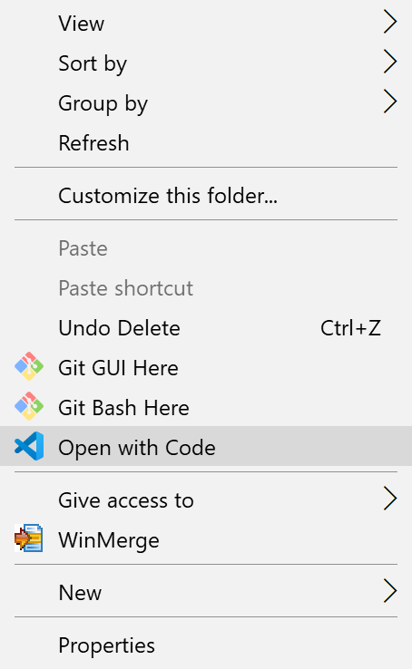
   
2. By default - in VS Code when you single click a file in the Explorer pane - it opens and is displayed in italics - which indicates it is open in a preview mode. If you open another file it replaces the previous file.
    
     Try single clicking the file **license-agreement.txt**. 

     Does it open with italics? If using a virtual machine, this may have already been changed for you and you can skip to 

    

3.   Now single click the file **optional-github.md** and it will replace the **license-agreement.txt** file. 
    
        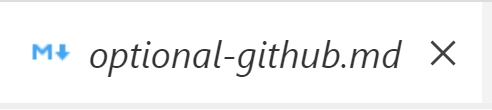
       
4.   If you double click on the tab it will become solid and opening another file will not replace its contents.

        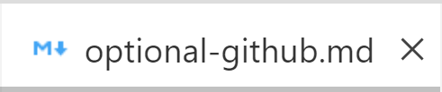

5. To make single clicking not open in preview mode, you can change VS Code settings. First click the gear icon to open the settings menu.

    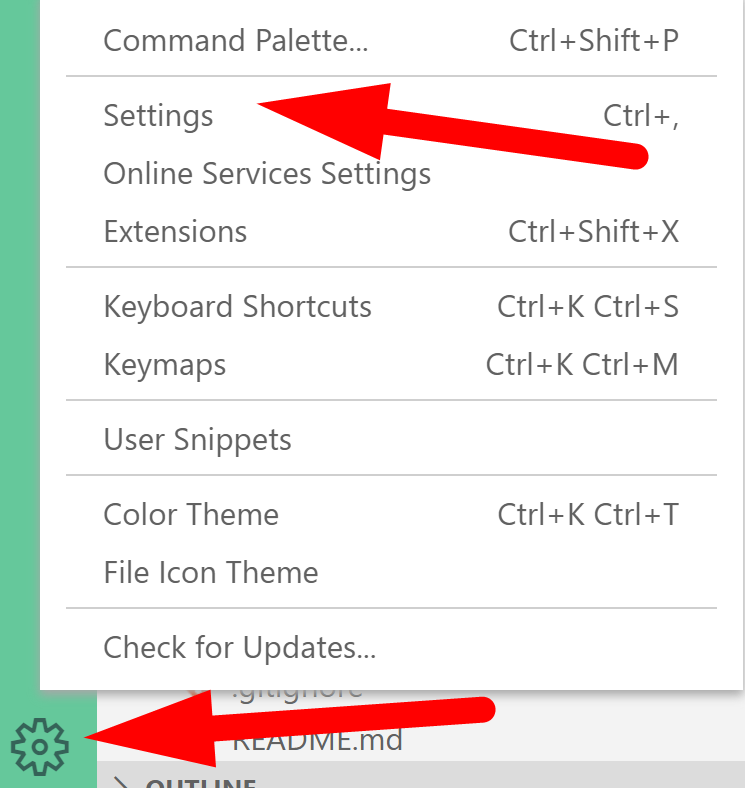

6. Then in the search field start typing open. Click the editor manager under Workbench, and deselect the checkbox for Enable Preview.

    

### **Part 3 - Toggle Word Wrapping in VS Code**
[back to top](#table-of-contents-for-this-lab)

7. Now single click the file **really-long-file.txt** and it should open in its own tab and not be in italics.

   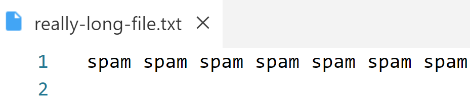

   **Toggle text wrapping**
8. If VS Code is not wrapping, you will just see one line of text and need to scroll to the right to see the contents. Use the View menu or shortcut of Alt-Z to toggle the word wrap.

    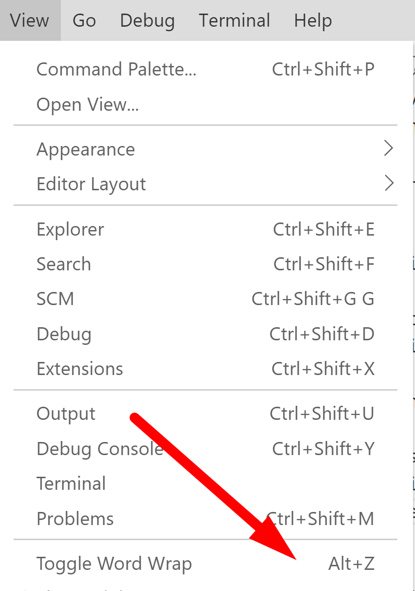

9.  Notice the line number isn't incrementing it is still just one line - but easier to read.

   

### **Part 4 - Opening Markdown .md files in VS Code in Preview Mode**
[back to top](#table-of-contents-for-this-lab)

    We use markdown files in this class for lab directions as they are used extensively in the industry with modern web projects.  
    
    These plain text files end in the extension .md and are used to describe Angular projects.
    
    Special characters are used to indicate the meaning of text and how to display it when used on websites.
    
    On repository sites such as GitHub and Bitbucket a README.md in the root directory describes repositories and how to build and run dynamic projects. If you like to use Reddit you can use markdown to style your posts.
    
    The default mode of VS Code opens .md files in EDIT MODE where you see the special characters for formatting. VS Code also offers a PREVIEW MODE so you can more easily read the styled text.

    We will look at multiple ways to open markdown files in PREVIEW MODE in VS Code. You will use these methods for lab exercises and some demos. 

**OPENING PREVIEW USING CTRL-SHIFT-V**

1. If you are reading the instructions in this README.md on GIthub you can continue to do so, but you also need to open this README.md file from within VS Code under the Angular100-Labs project.
   
2. Within VS Code, make sure that this README.md has focus. (click this text in the VS Code editor if the document has lost focus).
   
3.  Now, hit this key combination control-shift-V:  it launches a new tab showing this file in PREVIEW MODE. You can then navigate back and forth by clicking the tabs.  
   
   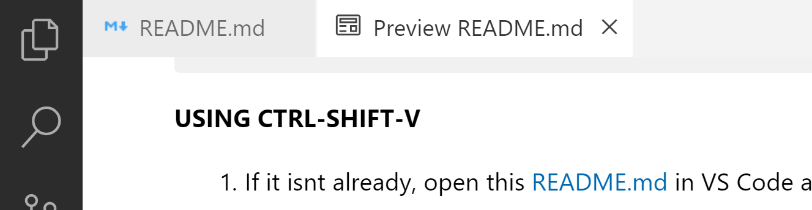
   

   **OPENING A SPLIT SCREEN**

4. Open a Split screen in order to view both at the same time by clicking on this icon 
    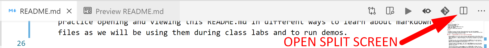

4. Drag the tab to the other window.
    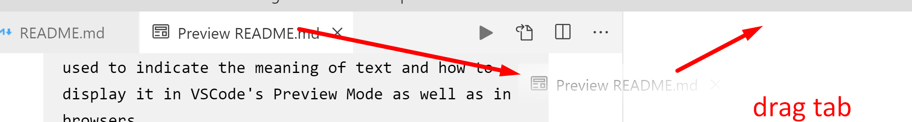

    You should now see the two files at the same time. With both Edit mode and Preview mode open in split panes, notice that if you scroll in one, the other scrolls as well.

    Remember this process to split the panes, it will be helpful when you want to see two files at the same time - such as lab instructions and the file you are editing.

    **VERTICAL MENU BUTTONS TOGGLE**

5. Give yourself more room to view code by hiding the leftmost pane. It should currently be the Explorer pane. Clicking the Explorer pane icon - pictured here with a blue circle and 1 will toggle this view. All of the icons in this vertical menu can be toggled to give you more room to work. Practice clicking to show and hide the menus.

    

    **MARKDOWN FORMATTING**

7. Make sure you can see both the Edit Mode in VS Code and the Preview Mode in VS Code or GitHub while you review the following:

    * Hash marks (#), are used for formatting headings.
        * A single # is heading "level 1" which is biggest, ## is "level 2", slightly smaller, and so on.
    * The asterisk is used to make a bullet.
        * Tabs are used for indentation of bullets.
    * Text can be highlighted using `backticks` around key words.
    * Code can be made **bold** using double asterisks.
    * Every item can be numbered as 1 in Edit Mode. When the markdown file is rendered: in preview mode or in browsers - the numbers will increment correctly.
        * This makes it easy to insert new items or re-order items, without needing to take the time to renumber.

    **OPEN PREVIEW TO SIDE**

8. Close all tabs in VS Code so that only the README.md is open in Edit Mode.
   
9.  When a markdown file is the active file, there is a button that automatically opens Preview in the split pane.
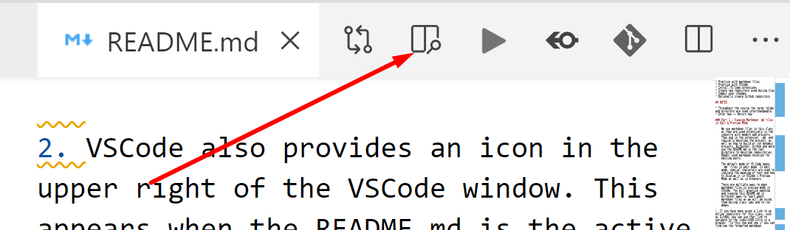

        Most everything in VS Code has a hover effect. If you forget what anything does, try hovering as most items have tool tips.

    **OPENING FROM EXPLORER PANE**
1. In VS Code, from the Explorer Pane, you can find the markdown file of interest, right click and choose **Open Preview**. Try this now with this README.md as shown.
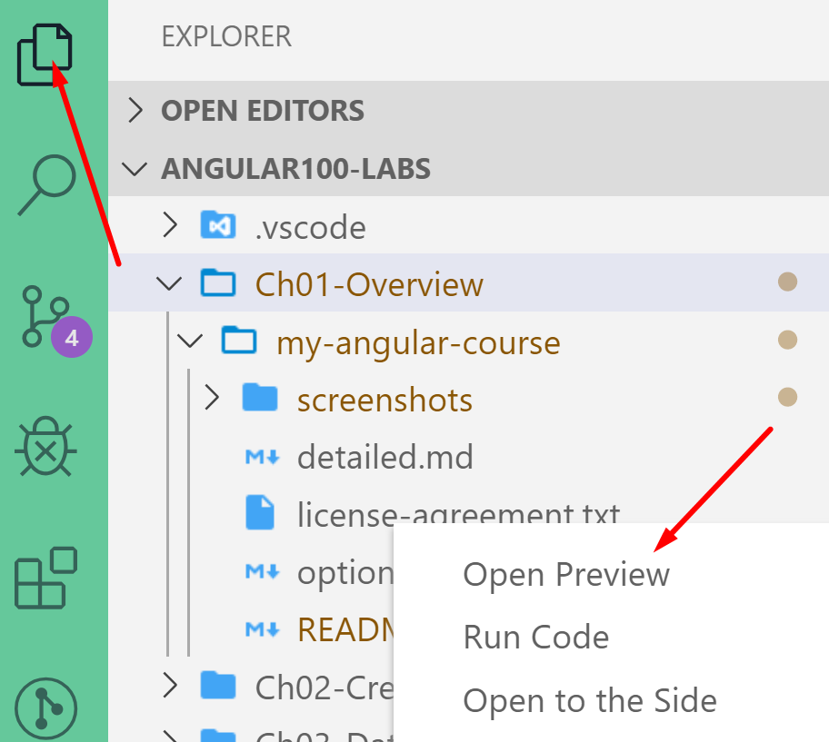

1. In VS Code, while viewing in Preview mode, if you double-click an area of the file, you will be taken back to the EDIT VIEW or "source" markdown file for editing.

    Notice that if you double click the  image shown above - it takes you to the edit mode version where the image is linked.

2.  For the rest of this lab exercise, view this file in Preview mode or on GitHub. 

### **Part 5 - Install and Use extensions**
[back to top](#table-of-contents-for-this-lab)

    The extensions pane allows you to search for, install, disable and remove extensions easily.

1. Look on the left side bar menu of VS Code and click on the `Extensions` icon or use the shortcut (Ctrl + Shift + X). 

    

2. Search for the extension VSCode Great Icons and change your font icons to use this extension. It will help greatly once we look at Angular projects.
   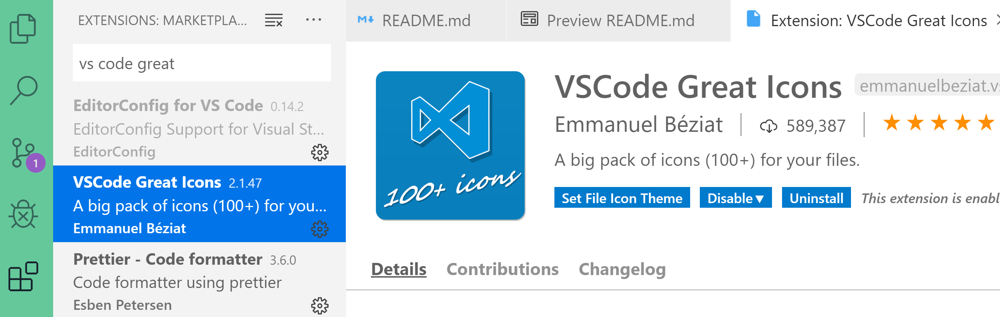

   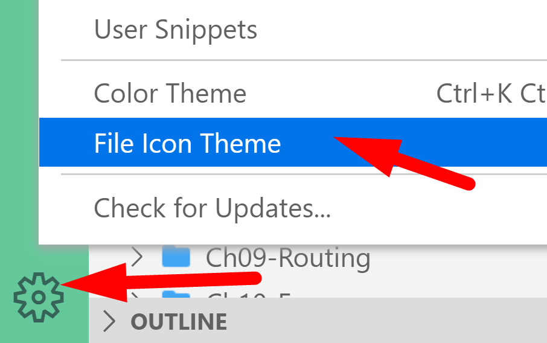

   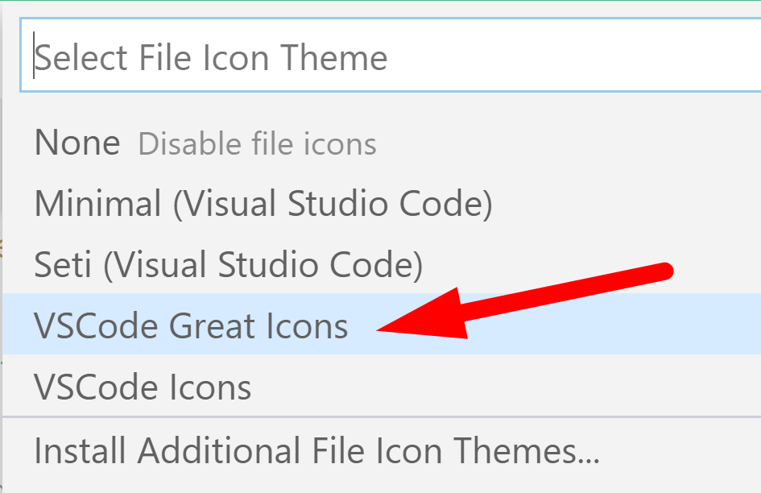

   
   
3. Search and install these extensions if not present: 
* Angular Essentials extension by the author John Papa
* Angular 8 Snippets by Mikael Morlund
* Bracket Pair Colorizer extension by CoenraadS
* TSLint extension by Microsoft
* GitLens - Git supercharged by Eric Amodio

## Part 6 - Find the Bonus section
[back to top](#table-of-contents-for-this-lab)

1. Navigate to the Ch1 bonus file in this repository.
   
2. Once you have found the file, mark your work as complete. Using shared spreadsheet, or name tent card, or whatever mean shared with your class.

3. Then work on the bonus problems