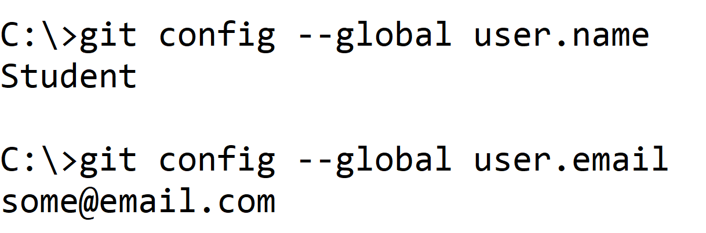
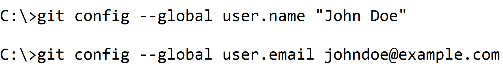
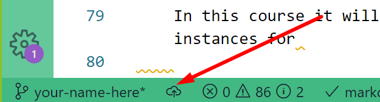
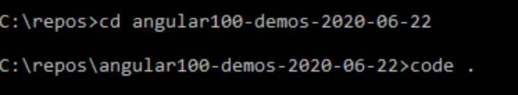
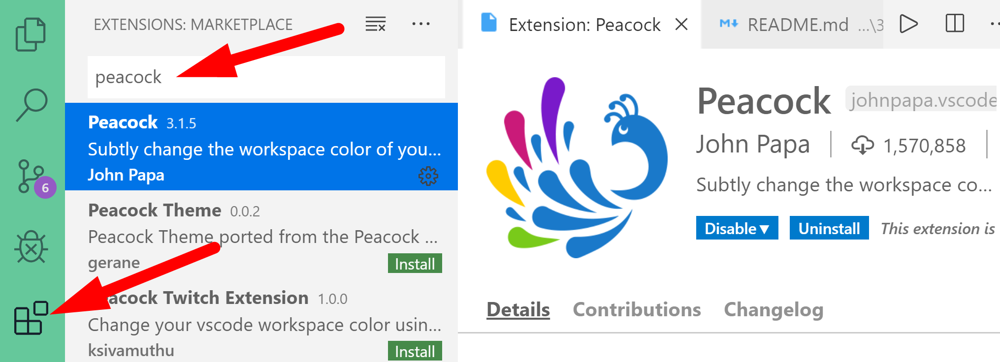
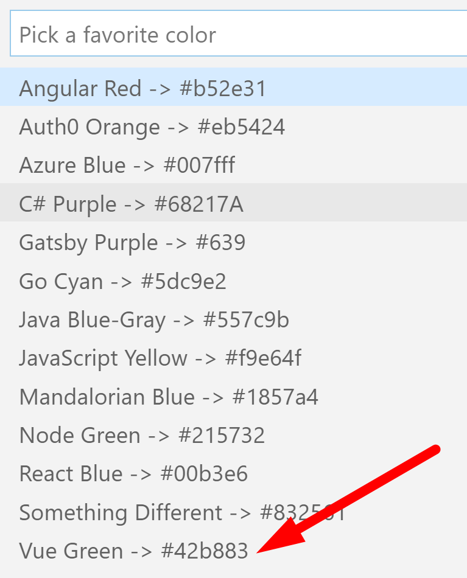
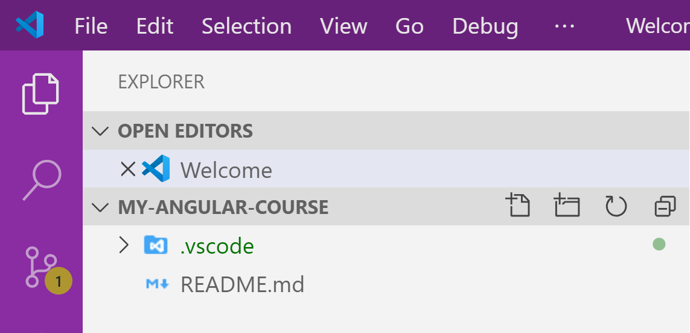
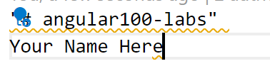
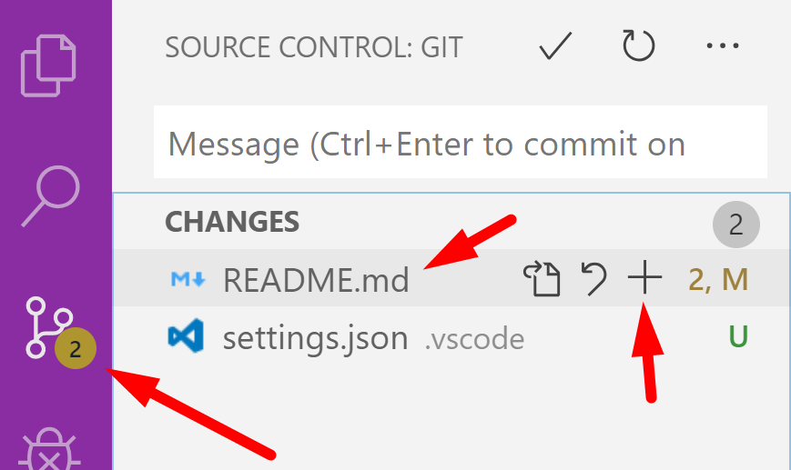

# Chapter 1: Part 2 - Create branch for your work and practice committing code

## Objectives

* Create new local repository used during class
* Commit changes
* Optionally create GitHub repository

## Table of Contents

[Part 1 - Create your own branch for your coursework](#part-1-create-your-own-branch-for-your-coursework)

[Part 2 - Opening Multiple Instances of VS Code](#part-2---opening-multiple-instances-of-vs-code)

[Part 3 - Using VS Code to commit changes](#part-3---using-vs-code-to-commit-changes)

[Part 4 - Use .gitignore to not track changes](#part-4---using-gitignore-to-ignore-changes)

[Part 5 - BONUS View GitLens extension](#part-5---BONUS-view-gitlens)

[Bonus - Explore VS Code](#bonus)

   
### **Part 1: Create your own branch for your coursework**
[back to top](#table-of-contents)

You will create a branch with your name in this project. It will be tracked by Git so that if you accidentally delete or change files you can recover them easily. (Later we will create an Angular project in this new branch) 

Git is an especially helpful tool while working with Angular. One reason for this is we will be using the Angular CLI tool to create and modify many files at once. 
    
Sometimes, you may accidentally run a command and modify a lot of files you did not mean to. It can be time consuming to clean this up! To make the process easier, and be able to UNDO - we will Git to track our files.
   
1. Depending on your lab setup, the global config for git may or may have not been setup. You can verify this by typing these commands into a command prompt.  These are global settings so you can be in any directory.

    

2. If there are values present, that is all you need for a local Git repo to be able to commit (and more easily discard) your changes.  
    
    It is a good practice to match to the info you would use on a remote repository, such as  GitHub, but it is not required.

3. To set up your personal git username and email idenitifers, use these commands - replacing **John Doe** inside the quotes with your name and **johndoe@example.com** with your email. Again, these are global settings so you can be in any directory.

    

4. Do the following to create a branch in which to do your work.
    * Click the bottom left where it says Master 
   
    
    * choose to create a new branch - use your name
    * 
    * This will now be the branch listed in the lower left corner. Click the cloud icon to push your changes to GitHub.
    

### **Part 2 - Opening Multiple Instances of VS Code**
[back to top](#table-of-contents)

Quite often you will need to have multiple instances of VS Code open.

For example, you may be referring to a sample project and comparing to your own project. 

VS Code allows use of control+c and control+v and corresponding context menu options to copy and paste files and directories between projects.  

1. From a Command Prompt open the C:\repos\angular100-demos directory (with the date of your class) and execute the command **code .** to open the project in VS Code. 

    

2. Search the Extensions Marketplace to find `Peacock` by John Papa. If you do not have it already installed click the install button.
   
   

    This extension lets us easily provide a color to the top and left sidebars of each instance of VS Code we open. 
    
    In the real world this is helpful as you may have reference implementation projects open as well as your own work.

    In this course it will be helpful as we will have different VS Code instances for 
    
    * Angular100-labs 
    * Angular100-solutions
    * Angular100-demos
    
3. To use the extension, hit control+shift+p to bring up the command pallette and start typing Peacock.
   
   
   
4. You should see a list of options, choose Vue green to identify the VS Code instance for your labs.

   

5. You should now have two instances of VS Code running. In your angular100-labs project, in your branch - use Peacock to change the color to C# purple. 

   1. Control+shift+p for command palette
   2. start typing peacock 
   3. choose C# purple
   
   

#### Switch between instances using Windows Task Bar

1. Move your cursor to the VS Code icon in  the windows status bar.
   
2. You should see your two VS Code instances with their colors. Peacock makes switching easier.

 

  
### **Part 3 - Using VS Code to Commit Changes**
[back to top](#table-of-contents)

Make sure you are in your branch of the angular100-labs project

1.  Create a new file called **_my_info.txt** by hovering over Angular100-labs and choosing new File icon.
    
   
   
2.  Inside your new **_my_info.txt** file, add your name. 
    

3.  Click on the Source Control button to open the panel `Source Control`. In this panel, mouse over the README.md file; press the `+` button that appeared to stage the change. You can also stage the change by right clicking on the README.md and clicking `Stage Changes`. You should now see that `README.md` was added to `Staged Changes`

    

4.  Above `Staged Changes` you should see a text input field with the text **Message (press Ctrl+Enter to commit)**. Within this field enter a good commit message which describes the changes we staged in the previous step.

    

5.  Click the check mark above the text message field to commit the changes made to README.md
   

### **Part 5 - BONUS View GitLens** 
[back to top](#table-of-contents)

1.  On VS Code's left hand toolbar, click on the `GitLens` extension you installed earlier. This extension contains additional features.

    

1.  Familiarize yourself with `GitLens'` panel. Notice how you can use it to access different repositories and their branches, remote, your stashes, etc. Also notice how you can navigate through it to see history of a file, a line, or compare files between different branches or between local and remote.

## Bonus
[back to top](#table-of-contents)

1. If done before others, explore the VS Code Interactive Playground
   

