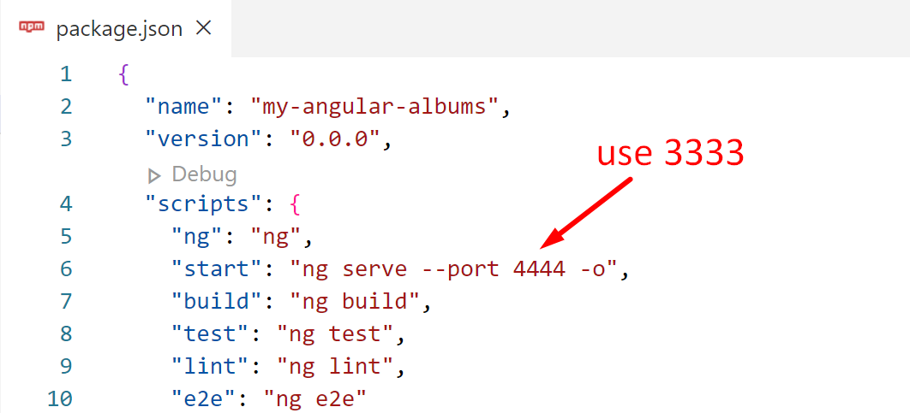

# Chapter 2: Modify Port of your Project

## Objectives

- Modify the package.json of your current project
- Start and notice how Angular projects run

## Part 1 - start project and view output

1. Find the package.json file and modify the port and indicate to open the default browser.

    

2. Open the terminal with control + ` or View | Terminal and run npm start

