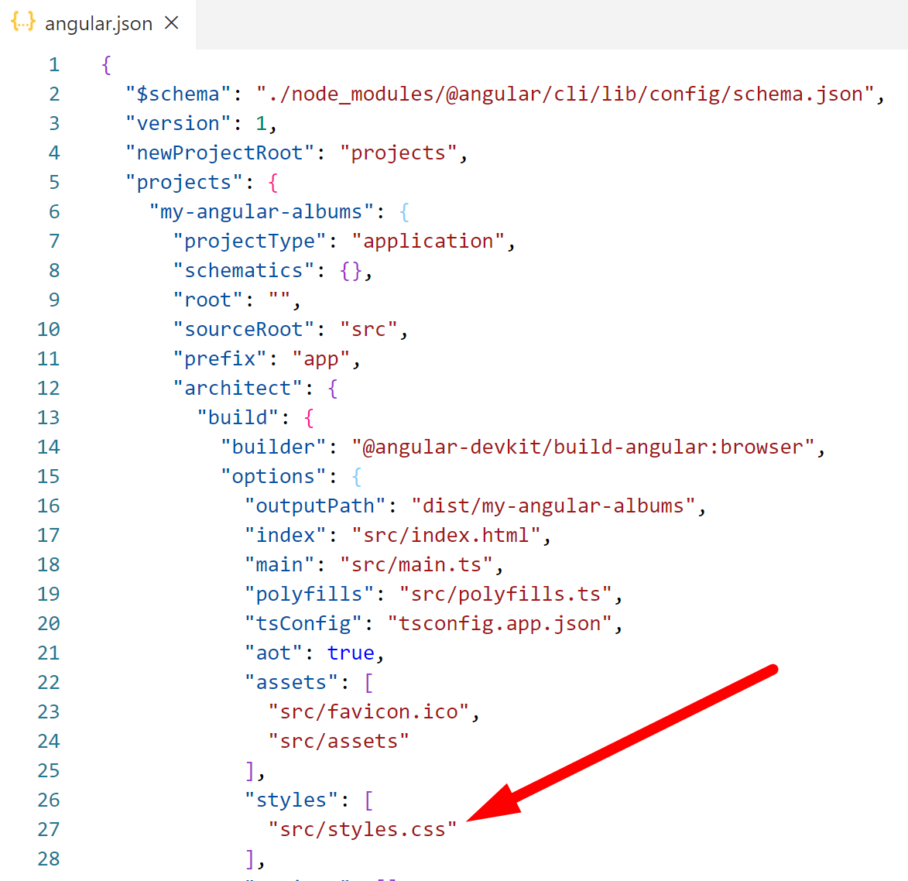

# Lab Chapter 2: 4.  Add Bootstrap to the project

## Objectives

- Install Bootstrap as a dependency
- Reference bootstrap in angular-cli.json
- Test that bootstrap is available

## Steps

1. From the VS Code terminal in your project use this command to install bootstrap

   ```bash
   npm install bootstrap -S
   ```

1. Open **angular.json** and find the area under the property projects.my-angular-albums.architect.build.styles
   

1. Update the styles property so that it has these two entries:
   ```JSON
     "styles": [
          "./node_modules/bootstrap/dist/css/bootstrap.min.css",
          "src/styles.css"
     ]
   ```

2. If you already have the server running, stop and restart the server to pick up the new changes from angular.json that make Bootstrap now available.
  
3.  Open the file **app.component.html** and remove all of its contents. (control-a will select all and you can hit delete). 
   
4. Add this content in its place, it should be the only code in the file.

   ```html
   <div style="text-align:center;">
     <h1 class="jumbotron my-5 mx-5">
       Welcome to {{ title }}!
     </h1>
   </div>
   ```

3. When you revisit the browser it should be updated with this content.

4. Mark your work as complete. (Name tent card, electronic status, etc.)
