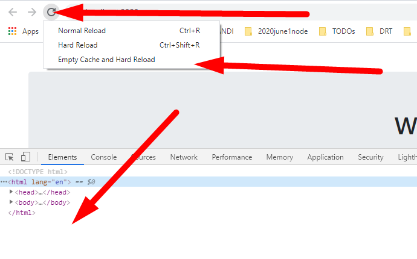

# Chapter 2: 5. Add favicon to the project

## Objectives

- Add a favicon to the project

## Steps

1. Find and rename the current favicon.ico file to favicon.ico.old.
   * You can right click on, and rename the existing favicon.ico file. 
   

1. Now, copy the **favicon.ico** file from the same directory as THIS README.md file. You can click and control+c to copy. Or right click and choose copy.
   
1. Now, paste the **favicon.ico** you just copied into the folder for your my-angular-albums project.

1. We will need to restart our server for this change to take effect. Kill your server if it is running by pressing **ctrl + c**. Then run **npm start** 

1. You may need to do a hard refresh of the browser to see the icon change. In Chrome, do this by having the dev tools open and right-clicking the refresh icon of the browser. Choose hard refresh.

What you should see:

