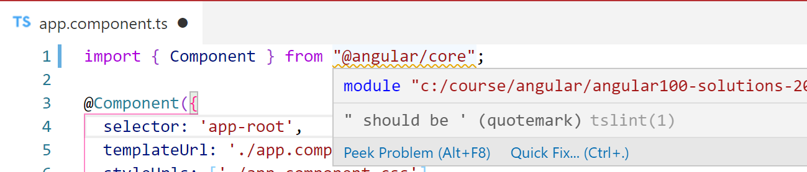
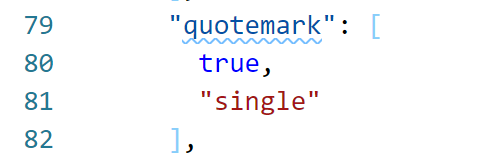
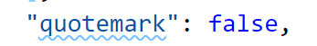

# Chapter 3: Add data that is type checked to the project

## Objectives

- Add data to the project
- Define an interface to indicate the type of the data

## Steps

### Part 1: Modify TSLint rule

1. Open **/src/app/app.component.ts** and notice the string values for all the statements use single-quotes '

1. On the first line of **app.component.ts**, change the import statement to use double-quotes " instead of single-quotes '

    

    Notice the squiggly line and when you hover over it, a message from tslint indicates that the double-quotes " should be single-quotes '. 
    
    This rule comes from Google's Style Guide and historically was a 'nice to have' because everyone used to put lots of HTML strings inside of JS; this meant you could have double-quoted HTML attributes inside a string without escaping the quotes. Since many teams vary their use of quotes, let's turn this off. 

1. Open **/tslint.json** and find the rule as shown:

    

1. Turn off rules by simply setting the value to false as shown.
    

    Remember to save your changes.
    
1. If you go back to your **app.component.ts** file you should no longer see a squiggly line because tslint now accepts double-quotes


### Part 2: Add data for the App component


1.  Data is added VIA the **.component.ts** type files. We will start by modifying the file **app.component.ts**. Open this file and after the line with **title = "My Angular Albums";**
    and a property called **albumsArray**

    ```typescript
    albumsArray: any;
    ```

    The use of any indicates that albumsArray can be of any type. We are using it now to demonstrate that there are no restrictions with any.

2.  Modify the line with the class export to include implements OnInit like this:

    ```typescript
    export class AppComponent implements OnInit {
    ```

    We will be exploring this in more detail, it indicates that you intend to implement a method called **ngOnInit()** which is defined in the OnInit interface. This method is called when the component is loaded by Angular.

3.  Mouse over the red wavy underline that **OnInit** has. You must import **OnInit**. Depending on the extensions you have installed, this may have already been done for you - if not, modify the top of **app.component.ts** which imports from Angular core to look like this:

    ```typescript
    import { Component, OnInit } from "@angular/core";
    ```

    Alternatively, you can click the 'Quick Fix' suggested to you when you mouse over the red way underline and it will add it for you.

4.  You may see errors that you need to now implement OnInit. Do this by adding this function in the class after the property definitions - but before the closing brace } for the class.

    ```typescript
    ngOnInit(): void {    }
    ```

5.  Inside of this **ngOnInit()** function is where you should initialize the **albumsArray** property you created. For now copy the below code to setup an array of albums. In the future we will get these from a server.

    There are intentionally some issues with this array data. The first item has id as a string value and the next as a number. Let's define an interface to do type checking against this data.

    ```typescript
    ngOnInit(): void {
      this.albumsArray = [
        {
          id: "1",
          artist: "Tremonti",
          albumName: "Dust",
          isOnSale: "true",
          price: 11.99,
          currency: "USD",
          year: 2016,
          releaseDate: "April 29, 2016",
          recordingLocation: "Studio Barbarosa, Orlando, FL",
          genre: "Pop/Rock",
          duration: "43:18:00",
          URL: "https://www.allmusic.com/album/dust-mw0002918360"
        },
        {
          id: 2,
          artist: "Bon Jovi",
          albumName: "7800 Fahrerenheit",
          isOnSale: false,
          price: 7,
          year: 1985,
          currency: "USD",
          releaseDate: "April 20, 1985",
          recordingLocation: "Warehouse, Philadelphia, PA",
          genre: "Pop/Rock",
          duration: "47:15:00",
          URL: "https://www.allmusic.com/album/7800%C2%B0-fahrenheit-mw0000189199"
        },
        {
          id: 3,
          artist: "The Beatles",
          albumName: "The White Album",
          isOnSale: true,
          currency: "GBP",
          price: 24,
          year: 1968,
          releaseDate: "November 22, 1968",
          recordingLocation: "",
          genre: "Pop/Rock",
          duration: "1:33:43",
          URL: "https://www.allmusic.com/album/the-beatles-white-album-mw0000418113"
        }];
    }
    ```

6.  In the **ngOnInit()** use a console.log to print the data `console.log(this.albumsArray);` and make sure it displays in the console of the browser.

7.  You may notice that there are some purposeful issues with this array data. The first item has id as a string value and the other as a number. Lets define an interface to do type checking against this data.

8.  Open the integrated terminal. Create an interface for Album by using this Angular CLI command. Note that g is short for generate,and this will be created in a subfolder called albums.

    ```bat
    ng g interface albums/album --type=model
    ```

9.  Notice the creation of the directory albums and the naming of the file **album.model.ts** the type flag was used to name the file with the type. Look inside this file and notice it is rather bare bones but exports an interface.

10. Complete the interface so that it looks like this:

    ```javascript
    export interface Album {
      id: number;
      artist: string;
      albumName: string;
      genre: string;
      price: number;
      currency: string;
      onSale: boolean;
      year: number;
      releaseDate: string;
      recordingLocation: string;
      duration: string;
      url: string;
    }
    ```

11. Import the Album class.

    ```typescript
    import { Album } from "./albums/album.model";
    ```

12. Now make the property of albumsArray be of type Album[]

    ```typescript
    albumsArray: Album[];
    ```

13. You should now get errors about the data not quite matching up. Fix the hard-coded array items to update the id and onSale. For currency, data may not exists so add a question mark so data looks something like this:

    ```typescript
    export interface Album {
      id: number;
      artist: string;
      albumName: string;
      genre: string;
      price: number;
      currency?: string;
    ```

14. Make the necessary changes so the code compiles and runs in the browser.

15. Mark your work as complete.
