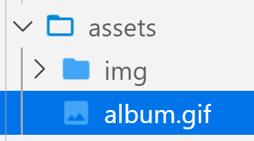
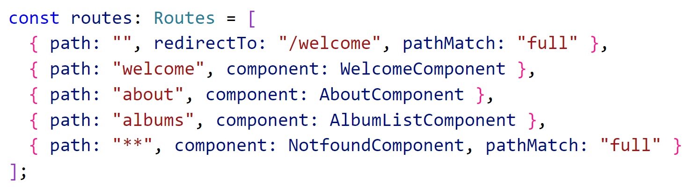
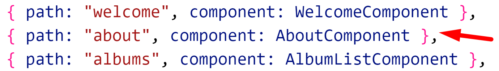
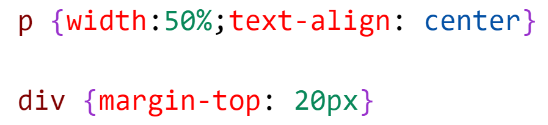

# Chapter 9 Routing: Lab 1 Add Routing to your application

## Objectives

- Create additional "pages" and use Routing in your application 
- Add the use of the bootstrap responsive navbar functionality

## Overview

* You will create two new components: Welcome and About. 
* You will setup routing so that both of these views are reachable.
* If anyone goes to the main page they will be routed to Welcome. 
* Finally you will create a nav bar that has links to load up the correct "pages"

## Steps

1. Continue working in your angular100-labs project in your branch. If you haven't completed previous exercises, you can copy the last solution's **src** directory over your src directory.

2. We are going to use Bootstrap to style the navbar and make it be responsive, which requires **bootstrap.min.js**, **jquery** and **popper**. We have already installed Bootstrap, so **bootstrap.min.js** is available, but we need to install jquery and popper.

   ```bat
    npm i popper.js jquery -S
   ```

3. Update **angular.json** in order to refer to the .js files. Find the **projects.architect.build.options.scripts** property and add these items to the array:

   ```javascript
    "scripts": [
        "node_modules/jquery/dist/jquery.min.js",
        "node_modules/popper.js/dist/umd/popper.min.js",
        "node_modules/bootstrap/dist/js/bootstrap.min.js"
      ]
   ```

4. Because **angular.json** was updated you need to restart the server for changes to be picked up. If it is running stop the server using control-c. Restart the server.

5. Let's create the **Welcome** "page" for our application. Use the -is flag to make the component have inline styling. (alternatively you could use --inline-style)

   ```bat
   ng g c welcome -is
   ```

6. Modify the **welcome.component.html** template to display the following:

   ```html
      <div class="container">
        <div class="jumbotron my-5 mx-5 ">
          <h1 class="display-4">Welcome to {{ title }}!</h1>
          <p class="lead">The course project to practice Angular</p>
          <button
              type="button"
              routerLink="/albums"
              class="btn btn-primary text-center mt-3 mx-auto"
            >
              View Albums
            </button>
        </div>
      </div>
   ```

7. Create the title property within **welcome.component.ts** and set it equal to **My Angular Albums**.


3. We cannot reach this component yet.

4. Update **app.component.html** to simply be:

   ```html
       <router-outlet></router-outlet>
   ```


5.  Now we will add paths to be loaded beneath the `<router-outlet>` element.

   Add object elements to the Routes array in **app-routing.module.ts**:

   ```typescript
   const routes: Routes = [
     { path: "", redirectTo: "/welcome", pathMatch: "full" },
     { path: "welcome", component: WelcomeComponent },
     { path: "albums", component: AlbumListComponent }
   ];
   ```

11. Import the **WelcomeComponent** and **AlbumListComponent**.

   Remember that the convention is to have all @angular imports first, then a blank line, then all of the files we create and modify.

12. If not already open, open the browser to the following URL and you should see the Welcome page.

    ```http://localhost:3333/```
  
13. Manually type in the following URL and you should see the albums. If not fix your errors.

    ```http://localhost:3333/albums```

14. Let's create a navbar component to click links to change page views.

    ```bat
      ng g c navbar
    ```

15. Update **app.component.html** to include app-navbar:

     ```html above the router-outlet
        <app-navbar></app-navbar>
        <router-outlet></router-outlet>
     ```

16. In **navbar.component.ts** create this title property

    ```typescript
     title = "My Albums Project";
    ```

17. Use this content for the new **navbar.component.html**. Note the use of **routerLink**

    ```html
      <nav class="navbar navbar-expand-lg navbar-light bg-light">
      <a class="navbar-brand" routerLink="/">
      {{title}}
      
      </a>
      <button class="navbar-toggler" type="button" data-toggle="collapse" data-target="#navbarNav" aria-controls="navbarNav"
        aria-expanded="false" aria-label="Toggle navigation">
        <span class="navbar-toggler-icon"></span>
      </button>
      <div class="collapse navbar-collapse" id="navbarNav">
        <div class="navbar-nav">
          <ul class="navbar-nav mr-auto">
            <li class="nav-item">
              <a class="nav-link" [routerLink]="['/welcome']" routerLinkActive="router-link-active">Home</a></li>
            <li class="nav-item">
              <a class="nav-link" [routerLink]="['/albums']" routerLinkActive="router-link-active">View Albums</a></li>
            <li class="nav-item"><a class="nav-link" [routerLink]="['/about']"
                routerLinkActive="router-link-active">About</a></li>
          </ul>
        </div>
      </div>
    </nav>
    ```

18. Copy the image **album.gif** from the VS Code instance of angular100-labs (same folder as this README.md) into your my-angular-albums project's src/assets folder for its use in the navbar.



19. Test your changes in the browser and ensure you have no errors. You should see the navbar with image. If you click the Home and Albums links they should work. Clicking the nav brand "My Albums Project" should bring back the album page.
    

21. Modify the **Welcome** template to use a button to routerLink to albums.

    ```html
    <div class="jumbotron text-center">
      <h1 class="display-4">Welcome to {{ title }}!</h1>
      <button
        type="button"
        routerLink="/albums"
        class="btn btn-primary text-center mt-3 mx-auto"
      >
        View Albums
      </button>
    </div>
    ```

22. Try adding a non-existing URL in the browser bar such as the following and view the browser devtools console to see the error generated.

    ```http://localhost:3333/abc```

23. Generate a new component to be used for any bad urls.

    ```bat
    ng g c Notfound -it -is
    ```

24. Update the **Notfound** template to have this content

    ```html
      <h1 class="mt-3 mx-auto w-50">Error 404</h1>
      <p class="mt-3 mx-auto w-50">Page not found</p>
    ```

25. Update app-routing.module.ts routes to add a wildcard path with two asterisks. This must go at the end of your path objects. It will be the match if no other url matches.

  

  Make sure to import **NotfoundComponent**

25. Try adding a non-existing URL in the browser bar such as:

     ```http://localhost:3333/abc```

26. This should now load the 404 Error page and still include the nav bar.
    
27. You can also test by clicking the About tab in the navbar. We need to create this component as well.
    
28. Create the About Page using the CLI command: 

      ng g c about -it 
  
   
29. In the template property for the generated about component add this code:

    ```html
    <div><p>This app is written in Angular and displays music albums</p></div>
    ```
30. Update the routes to include an entry for about pointing to the AboutComponent.
   
    

1. Test that the route is reachable in the browser now.
   
2. You can add some styling for this component in the generated about.component.css file.

    

3.  Mark your work as complete.

## Bonus

1. If you are done before others, create a new app called About Me. Use routing and have a navbar that links to components for friends, family and hobbies.
   
2. For each component have an array of data for friends, family, hobbies. Start out as strings to test using ngFor to display.
   
3. Once that is working, turn these into arrays of objects, where each has a name and a since_date property.

4. Create a component that is passed a name and the since_date. 
   
5. Use this component on all three page components.
