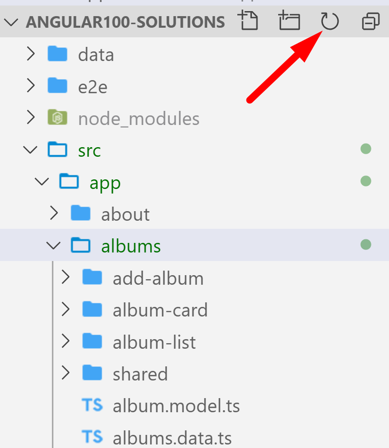
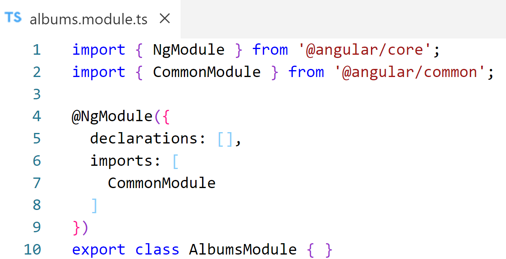
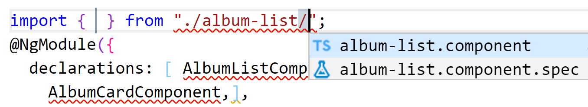
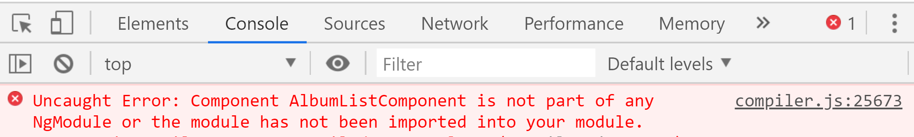
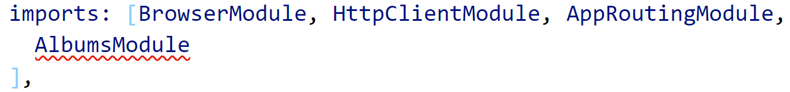
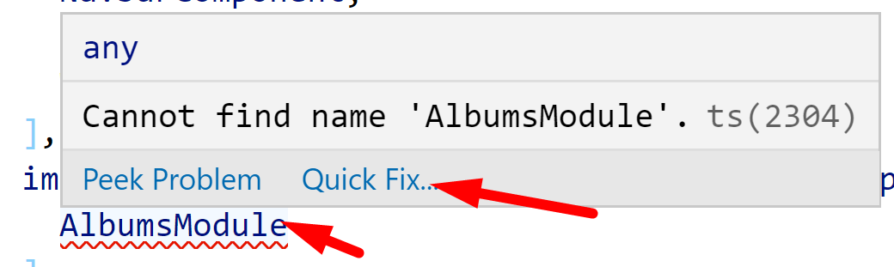
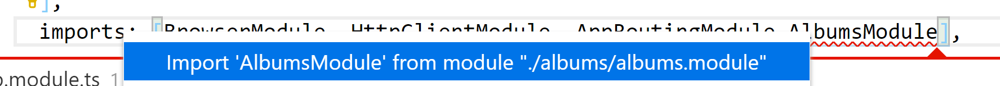
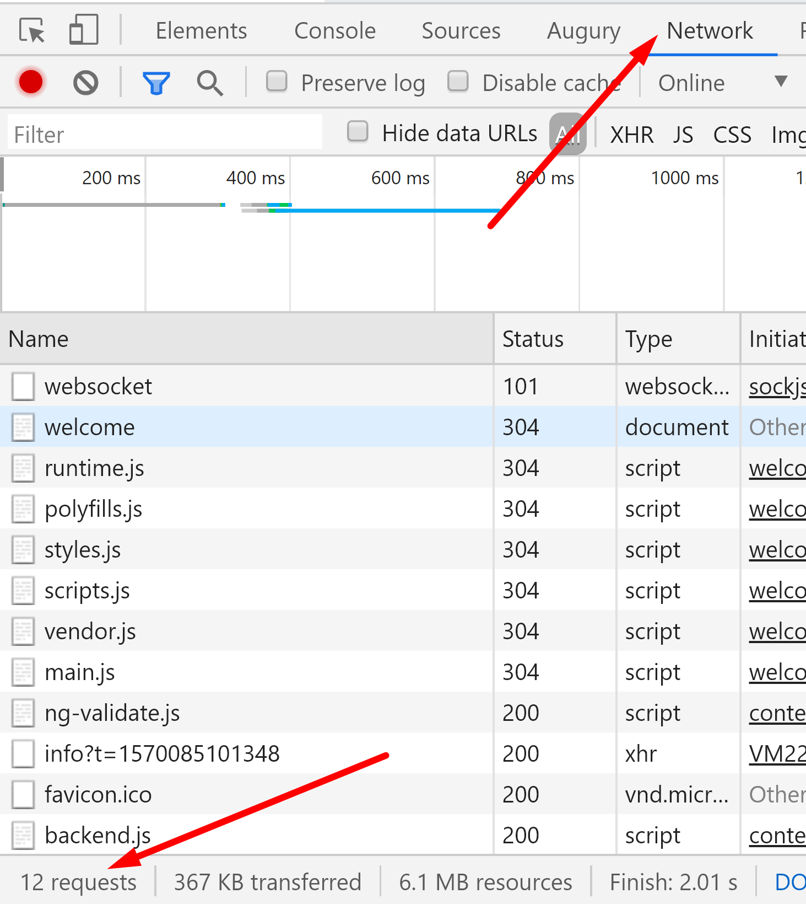

# Chapter 9 Routing: Feature Modules

## Objectives

- Organize your project by creating feature modules
- Import feature Modules into your AppModule
- Practice using dev tools to look at network traffic

## Steps

1. Continue working in your angular100-labs project in your branch. If you haven't completed previous exercises, you can copy the last solution's src directory over your src directory. You also would need to copy its package.json file over your package.json file to get necessary imports.

1. Examine your current AppModule file. How many components are in the declarations?

1. Create a feature module for albums. If you already have the folder, it creates the module inside a folder of the same name.
   ```console
   ng g m albums
   ```

    You may need to hit the VS Code refresh button to see changes.

    

2. Note the structure created for the new module. Similar to our original AppModule, it has the @NgModule Decorator where we can add components. NOTICE how CommonModule is included. this makes ngFor type directives available to components in this module.  Think about where you can add the components related to this module.   
  
    

   
3. Update **albums.module.ts** and add the components to the declarations property. Move the album related entries (AlbumCard, AlbumList) from AppModule's decorator declarations property into this new AlbumsModule. Can cut (control+x) and paste (control+v). 
   
4. Make sure you include the import statements at the top of this new module. Try typing the structure as shown and see how VS Code can help with auto-completion when you start typing.

    

5. Try to view the app in the browser. The App should load with a blank screen. Open the console to see the error message. Why do you think this is happening? What clue does the error message give you?
    


6. Each components must be inside of a module, and a component cannot be included in more than one module. We added the components to the new module, but did not add the new module to the root module yet. Now add the new AlbumsModule to the AppModule imports section. 

    

1. The Angular extensions offer an import completion under Quick Fix if you click the light bulb or hover and choose Quick Fix.
    
  
    

7. Now reload your application. It should work.

8. Open up the devtools in the browser and click on the network tab. From the Welcome page, hit refresh while looking at your application. You should see the listing of loaded modules and js files.  

    
 
9.  Now click on the About tab. Nothing new should appear in the network tab. If you click on albums you will see the data retrieved for images.

10. Mark your work as complete. 

## Bonus

1. Continue the last bonus and create modules for family, friends, and hobbies.