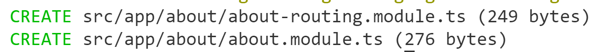
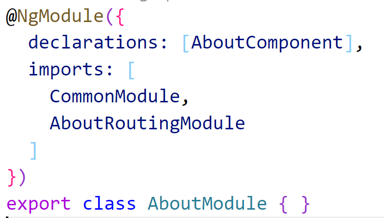
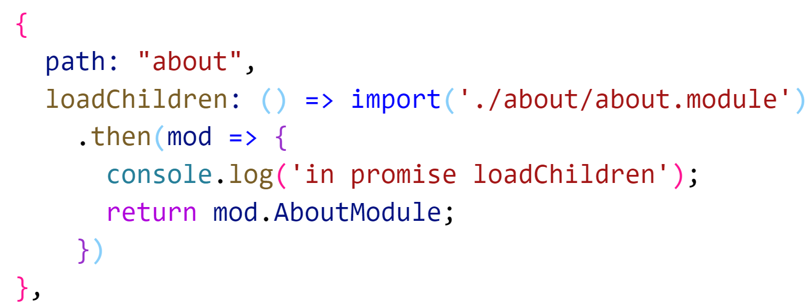
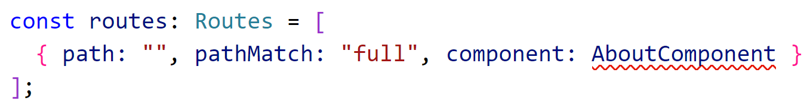
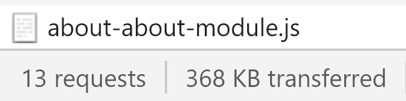
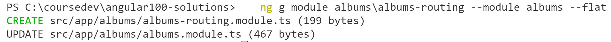

# Chapter 9 Routing: Lab 3 Lazy Loading Modules

## Objectives

- Use Lazy Loading with Routing in your application


### **Part 1 - Lazy Load About page**


1. Continue working in your angular100-labs project in your branch. If you haven't completed previous exercises, you can copy the last solution's src directory over your src directory.
   
2. Add a module and routing.module for **About** so that we can lazy load it. There is no About module yet - we can create both the module and the routing at the same time using this command.

    

3. This will generate two files.
    

4. Move the declaration of AboutComponent out of the root AppModule and into the new AboutModule.
   
   
5. Now in the root app routing module change the route for "about" to not point to a component, but to the AboutModule feature module itself. 
    
   

6. Update the AboutRoutingModule to have an entry that points to the AboutComponent. Note that empty string is used, because we are reaching this route from the app-routing.module.ts for "/about" already. Make sure to import the component.
    
    


7. Now test that your app works by loading it in the browser. Open the dev tools network traffic tab and refresh the welcome page. As before you should see requests.
   
8. Now, click on About while viewing the Network tab. An entry should appear at the bottom showing that the AboutModule was loaded and the count of requests should increase.

    

### **Part 2 - Lazy Load Albums page**

1. Create an **albums-routing.module.ts** to be referenced within the albums module. Because the albums folder and module already exist - you can use this CLI command to create the module, and to update the **albums.module.ts** to include it.

    ```console
    ng g module albums/albums-routing --module albums --flat
    ```

    You should see two changes.
     


1. In the AppRoutingModule file, modify the path for /albums to point to the feature module, rather than a component. 

    ```javascript
    {
        path: "albums", //Angular 8 Notation with Promise
        loadChildren: () => import('./albums/albums.module')
                            .then(mod => {
                            console.log('in promise loadChildren');
                            return mod.AlbumsModule;
                            }),
    },
    ```


8. Add a route in the newly created **albums-routing.module.ts** that points to the **AlbumsListComponent** - make sure the AlbumListComponent file is imported.

    ```javascript
    const routes: Routes = [
    { path: "", pathMatch: "full", component: AlbumListComponent }
    ];
    ```

9.  Check that your app works as expected. 

10. Mark your work as complete. 

## Bonus

1. Continue with the Bonus started earlier in this chapter. Modify your project to use feature modules and lazy loading for Friends, Family and Hobbies.