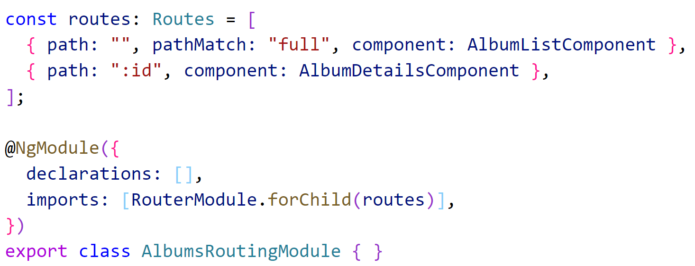
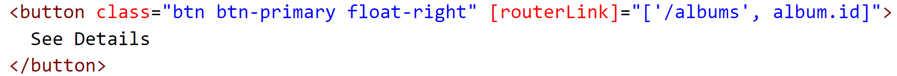
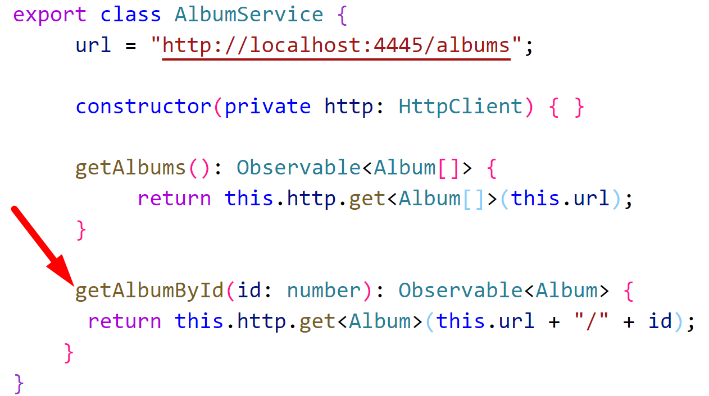
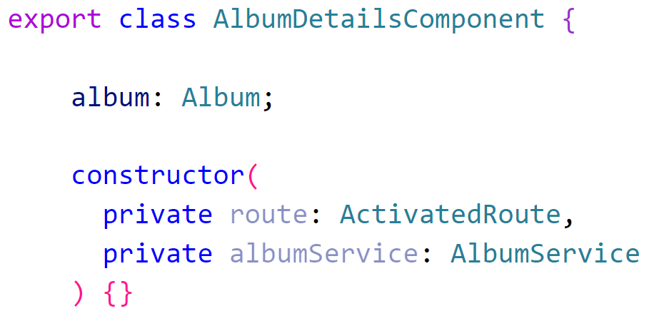
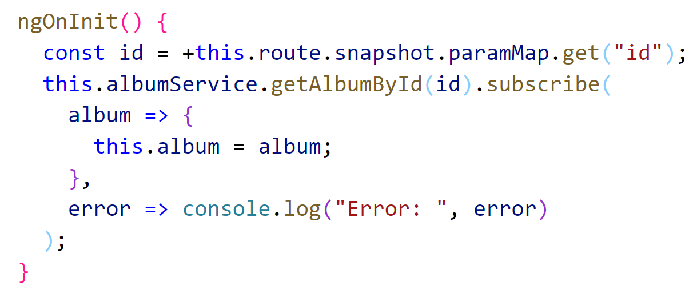
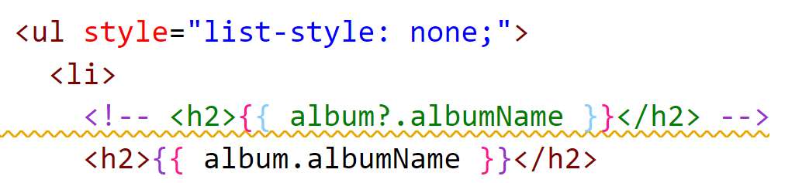

# Chapter 9 Routing: Lab 4 Work with Route parameters

## Objectives

- Create a page of details for each album
- Navigate to the details page using route parameters

## Steps

1. Continue working in your angular100-labs project in your branch. If you haven't completed previous exercises, you can copy the last solution's src directory over your src directory.

    ### **Part 1: Create Album Details Component and route to it**

2. Create a component for album details

  

3. Update the AlbumsRoutingModule routes to add an entry that will reach the placeholder details page saying it works. Use **:id** which accepts an id parameter. Ensure the Component is imported.
   
    

1. Test your app. 
   1. Click on albums, they should still be reachable. 
   2. Manually modify the URL to the following and you should see the generic message from Angular CLI for details that it worked.
    ```http://localhost:3333/albums/3```

    ### **Part 2: Create Dynamic link with routerlink**

2. Update the button in **album-card.component.html** - instead of a (click) - use **routerLink** which builds the url using the id value from album.

  


3.  Now test your app and verify that clicking the album button loads the details page.

### **Part 3 - Use a service to create the album details page**

1.  Create a function in **album.service.ts** which will get an album's details by adding the id value to the url.

  

2.  Update **album details component** to have a property **album** of type **Album**, and to be dependency injected wih ActivatedRoute and the AlbumService.

    
  
    Ensure the proper classes are imported. A quick way to do this is to mouse over one of the red wavy lines, click **Quick Fix**, and then hit **Add all missing imports**. Always ensure these shortcuts work as you intended and remember that the convention is to have all @angular imports first, then a blank line, then all of the files we create and modify.

3.  In **ngOnInit()** use the passed in route to get the album id, and call the new AlbumService method.

       
  Notice how the id is received using **route.snapshot.paramMap()**

4. Hover over the **get** function name in paramMap.get. What is the data type returned? 
   
5. The use of the + in front of the string value is a quick way in JavaScript to convert it to a number which is what the **getAlbumById** method expects.
   
6. Notice the use of subscribe. If the call to **getAlbumById** is successful, **this.album** is set, otherwise an error is logged to the console.

7.  Update the **album-details.component.html** to display album details on the page using the following code

    ```html
        <div class="container">
          <div class="row my-3">
          

          <ul style="list-style: none;">
            <li>
              <h2>{{ album?.albumName }}</h2>
            </li>
            <li>{{ album?.artist }}</li>
            <li>Year Released: {{ album?.year }}</li>
          </ul>
        </div>
        <div class="row">
          <h4>Tracks</h4>
          <table class="table">
            <thead class="thead-light">
              <tr>
                <th scope="col">#</th>
                <th scope="col">Title</th>
                <th scope="col">Duration</th>
              </tr>
            </thead>
            <tbody *ngIf="album">
              <tr *ngFor="let track of album.tracks">
                <th scope="row">{{ track.trackNumber }}</th>
                <td>{{ track.title }}</td>
                <td>{{ track.length }}</td>
              </tr>
            </tbody>
          </table>
        </div>
        </div>
    ```

8.  Ensure your code is working in the browser by clicking through to the details page.

9.  Copy the code where the album name is being displayed. Comment out the original, (in VS Code you can be on the link and use control + /) and in the copy you made take away the ? mark. 

      

10. Does it work in the browser? Take a look at the console log messages. Why is this happening?

11. Reverse the comments so that the question mark is included.
    
12.  Where the tracks are listed, what happens if you  remove the *ngIf from around the *ngFor? Why is this happening?
    
13. Undo the removal of the *ngIf and ensure your app is working. 

14. Mark your work as complete.

## Bonus

1. Continue working on your bonus app. If you haven't already use JSON server to supply the data for friends, family and hobbies. Create a json file with details about friends, family, hobbies. You can make all data have a description field and display that when one is selected passing the route parameter. Similar the exercise, have services that return all data, and only one by id. 
