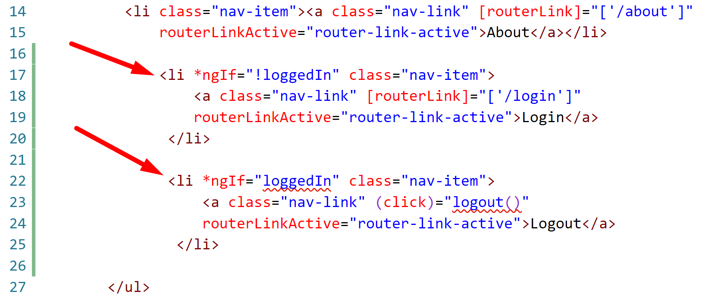

# Chapter 9 Routing: Route Guards

## Objectives

- Add a Route Guard to stop navigation to a page if not logged in

### **Part 1: Add Login/Logout to Navbar**

1. Continue working in your angular100-labs project in your branch. If you haven't completed previous exercises, you can copy the last solution's src directory over your src directory.

1. First let's generate a new page for Login.
   
    
   
1. Add a route for the login to the AppRoutingModule.

    

1. Test that if you manually enter the URL with /login that you reach the login page.

1. In the navbar template file, add two entries after the About list item, before the closing **ul**

    

1. In the navbar component class - add the property loggedIn and set it to false.

    
   
2. Test your app, the navbar should display Login.

    

3. Use Augury to change the value of loggedIn to true. 

    

1. Your app should now display Logout.

    

 
### **Part 2: Create fake login process**

1. First let's create a very simplified AuthenticationService. 
    
   
  
2. In the same folder as this README are files that you can copy their contents in to replace what is in your created files. Modify the LoginComponent and AuthenticationService by using these files to replace the contents of those files.

    

1. Review the code of each. The AuthenticationService allows components to subscribe to get the logged in status and be notified when it changes.
   

1. Now update the navbar to use the service, and subscribe to changes in the status of being logged in.

    

1. Update the login template to have a button call the login function. 

    

1. Test your work. Clicking on the Login button should now cause the NavBar to display logout.

### **Part 3: Use RouteGuard to stop navigation to page**

1. Generate a route guard and choose CanActivate in the CLI menu by using the space bar - then hit Enter.

    

    

1. Notice the generated code for canActivate simply returns true. Change this to false.
   
1. Now modify the **AppRoutingModule** to use the guard to protect the View Albums page. 

    

2. If you try to navigate to the View Albums page you will be blocked. In the next steps you wil be forced to login.
   
3. Update the AuthGuard class, to use dependency injection in the constructor to give access to the AuthenticationService and the Router.

    

4. Now modify the canActivate method of the AuthGuard to use logic to determine if user can route to the page using teh authService.
   
    

5. Test your app. While not logged in you should not be able to route to Albums. If you click Login in navbar - you should be able to get to albums. 
   
6.  Mark your work as complete.

## Bonus

1. Continue working on the bonus project.