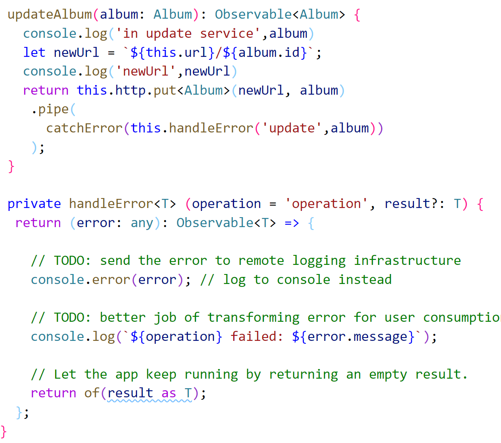
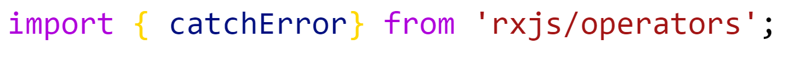
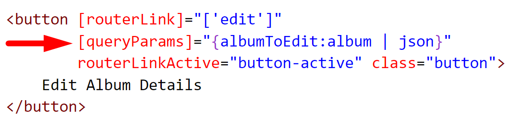
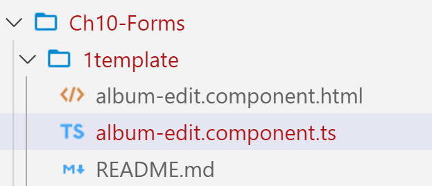
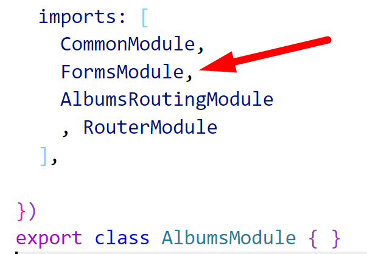

# Chapter 10 Forms: Template Driven - Edit Album

## Objectives

- Use template form to edit an album

## Steps

1. Continue working in your angular100-labs project in your branch. If you haven't completed previous exercises, you can copy the src directory from the solution files from the last exercise.

2. Follow the steps, noting that you can copy the content from included files in the lab. Either by navigating to the files in this folder on GitHub (if viewing on github now, right-click the following link to open in new tab), or opening in VS Code via a local angular100-labs folder.

    Online folder of files:
    https://github.com/JudyLipinski/angular100-labs/tree/master/Ch10-Forms/1template
   
3. Modify the AlbumService to include the use of HttpClient's put. We will use this to save the data changes. You can copy the content from **code-for-album-service.txt** - make sure you include the correct ES6 imports.

    

---
   If your extensions are not working you can manually add the import at the top     
  

4. Modify your **album-details.component.html** file so that you pass the album as a query parameter to the Edit component. This is possible through the following notation - passing an object with the property **albumToEdit** and the value is the object as a JSON string using the pipe operator.

     

5. From the same directory as this README - copy the file content for album-edit component and html to replace yours.
   

6. In VS Code editor, view the contents of the **album-edit.component.ts** file - noting the following:
   *  What is dependency injected into the constructor, and why?
   *  note the use of queryParamMap in ngOnInit() to get access to the query param that was sent
   *  we only are sending one so we get that string and parse it to get back to the object
   *  editAlbum will be called passing the album object that is modified in the form

7.  In VS Code editor, view the contents of the **album-edit.component.html** file - noting the following:
   * how is the template variable #form used to describe form state?
   * where is two way data binding being used?
   * what happens when the form is submitted? 

8.  Try to test your app. You should get errors in the console. Can you make out what it means?

9.  You need to import the **FormsModule** into your Albums feature module just as you did the CommonModule to make the directives for forms available.
   
   Note: Providers made available at root are available to features because of the way injectors work. Modules which give us access to directives such as FormsModule or CommonModule must be imported into the feature modules where you need them.

  

12. Make sure you also do the ES6 import of the FormsModule so that your code compiles. When changing modules, it can be good to start and restart your server as modules may have already been loaded into memory.
   
13. Now try navigating to an album, click on its detals button, and then reach the Edit page. 

14. Notice the state of the form as reflected in the pill. Remove the name of the artist and see the state change. Can you see which code is causing this?
    
15. Notice the button cannot be submitted until the form is valid.

16. Now change the name of the artist and hit submit.

17. You should be routed to the list of albums and see your changes as well as in the json file that json-server is using.

18. Discard your changes to the album-info.json file and mark your work as complete.

## Bonus

1.  Create a remove button on the details page that when clicked calls a method you create which uses a service to delete the item.
