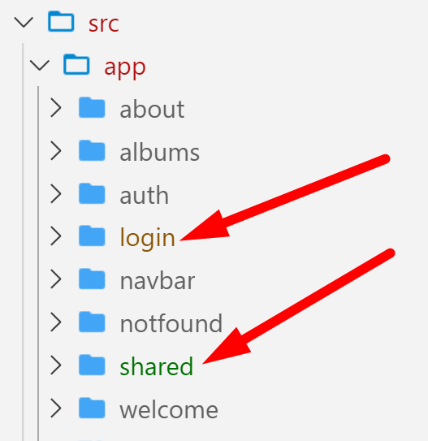
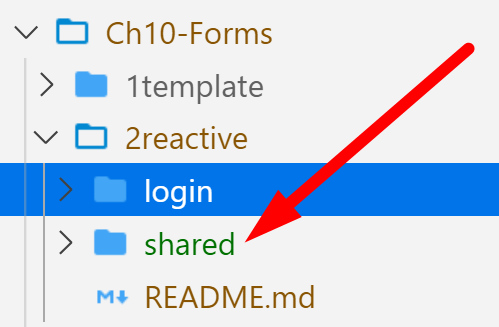
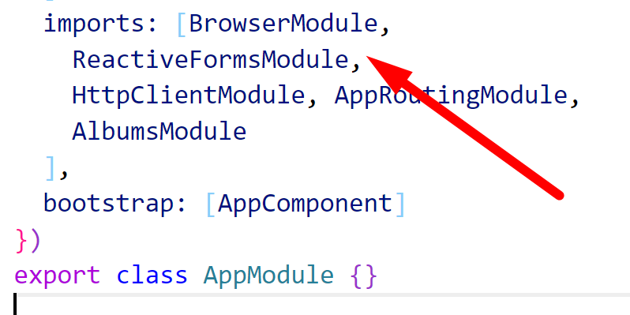

# Chapter 10 Forms: Reactive form - login

## Objectives

- Add a login form
- Update Display when user is logged in

## Steps

1. Continue working in your angular100-labs project in your branch. If you haven't completed previous exercises, you can copy the src directory from the solution in the last exercise over yours.

1. In your project navigate to your app/shared folder and app/login folders and delete them.

   

 
2. Make sure the angular100-labs project is open in VS Code and navigate to the same folder as this README.md. Copy the shared and login folders from here into your project **app** directory.

   

3. In **app.module.ts** in the @NgModule decorator of core, import **ReactiveFormsModule** to be able to create a reactive form in the LoginComponent. Make sure the import of the module as an ES6 import is at the top of the file.

   

   
4. View the new versions of files in the **/login** folder in the VS Code editor. 
    * In the **login.component.html** notice the use of formGroup and how the error messages, and submit are worked with conditionally.
    *  In the **login.component.ts** file, notice the work with FormBuilder, and setting up of email and password along with Validators. Validators.required is built in.
    *  The ValidationService.emailValidator and ValidationService.passwordValidator are custom. 

5.  With these changes in place your code should now work. Clicking on login should bring up the login page. 
    * Supplying an invalid email will give you feedback. Where is this defined in the code?
    * suppying **test@test.com** and **abcd1234** should log you in
    * How are these parameters being passed ot the service?
    * logout and try an invalid - properly formatted email 

1. Mark your work as complete. If you are done before others attempt the bonus.

## Bonus
1.  Use Reactive form to add a new album. 
    1.  create a button Add Album to the listing
    2.  use ReactiveForm to take in input
        1.  You can copy from previous exercise template but need to change to be reactive
    3.  create and call a new album service method that uses http.post
   